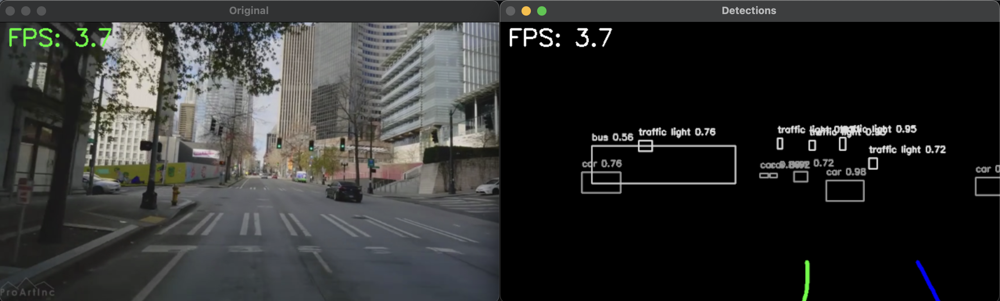

# Tesla FSD Visualization Clone

An attempt to rebuild the Tesla Full Self-Driving visualization feature using computer vision techniques.

## Features
- Single camera input
- Monocular Visual SLAM for 3D mapping
- Real-time lane detection

## Quick Start
